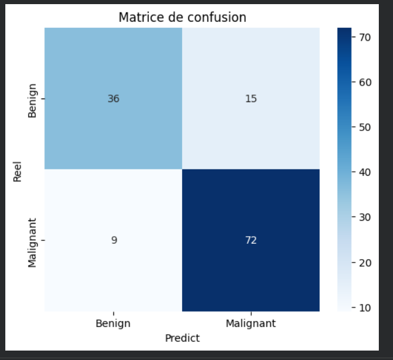

<div align="center">

#  SkinScan AI

### AI-Powered Skin Cancer Early Detection Platform


</div>

---

## 📌 Overview

**SkinScan AI** is a full-stack web platform that uses deep learning to assist in the early detection of skin cancer. Unlike traditional tools built only for doctors, SkinScan AI is a **complete end-to-end medical ecosystem** with two distinct portals:

-  **Patient Portal** — Anyone can upload a photo of a skin lesion from home, get an instant AI result, interact with Aria AI (an intelligent medical chatbot for patient education and support), and receive a personal response from a dermatologist if the result is concerning.
-  **Doctor Portal** — Dermatologists manage their analyses, receive automatic alerts for high-risk patient cases, and respond directly to patients through the platform.

>  *This platform is a screening aid only and does not constitute a medical diagnosis.*

---

## Demo

[](https://github.com/user-attachments/assets/9ba0f495-f6f4-4e17-9ab2-9bc429de542e)

---

## ✨ Key Features

### 🧑 Patient Side
| Feature | Description |
|---|---|
|  Register / Login | Patients create their own secure accounts |
|  Skin Scan | Upload a photo — AI analyzes it in seconds |
|  Skin Validator | Non-skin images are automatically rejected |
|  Instant AI Result | Benign or Malignant with confidence score |
|  Doctor Alert | Doctor automatically notified for Malignant results |
|  Doctor Response | Receive personalized feedback directly in dashboard |
|  Ask Aria | AI health assistant that explains results in simple language |
|  Delete Scans | Full control over personal scan history |

### 👨‍⚕️ Doctor Side
| Feature | Description |
|---|---|
|  Register / Login | Doctors create professional accounts |
|  Analyze Patients | Upload and analyze patient skin images |
|  Patient History | Full searchable list of all past analyses |
|  Alerts Dashboard | Malignant-only patient alerts with priority filtering |
|  Respond to Patients | Write and send clinical responses directly to patients |
|  Delete Records | Manage and clean up patient records |

### 🤖 AI & Technical Features
| Feature | Description |
|---|---|
| VGG16 Transfer Learning | Pre-trained CNN fine-tuned on dermatology images |
| Skin Validator | Rejects non-skin images using HSV color space analysis |
| Aria — Patient AI | LLaMA 3.3 70B powered assistant for patient questions |
| PRG Pattern | Prevents double form submissions on page refresh |
| `.env` Config | All secrets stored securely outside source code |

---

##  Architecture

```
┌─────────────────────────────────────────────────────────┐
│                     SkinScan AI Platform                │
├──────────────────────┬──────────────────────────────────┤
│    Patient Portal    │         Doctor Portal            │
│  ┌────────────────┐  │  ┌────────────────────────────┐  │
│  │ Register/Login │  │  │     Register / Login       │  │
│  │ Upload Scan    │  │  │     Analyze Patients       │  │
│  │ View Results   │  │  │     Alerts Dashboard       │  │
│  │ Ask Aria (AI)  │  │  │     Respond to Patients    │  │
│  │ Delete History │  │  │     Patient History        │  │
│  └────────────────┘  │  └────────────────────────────┘  │
├──────────────────────┴──────────────────────────────────┤
│                      Flask Backend                      │
│         VGG16 Model · MySQL · Groq LLaMA API            │
└─────────────────────────────────────────────────────────┘
```

---

## 🧠 AI Model — VGG16

The model is based on **VGG16**, a convolutional neural network pre-trained on ImageNet, adapted for binary skin cancer classification using **transfer learning**.

```
VGG16 Base (ImageNet weights)
  └── Block 1–4: Frozen
  └── Block 5 (last 4 layers): Fine-tuned
      └── Flatten
          └── Dense(256, relu)
              └── Dropout(0.5)
                  └── Dense(1, sigmoid) → 0 = Benign · 1 = Malignant
```

### Training Strategy

**Phase 1 — Top layers only**
- VGG16 base fully frozen
- Learning rate: `0.0001` · Epochs: up to 20 (EarlyStopping)

**Phase 2 — Fine-tuning**
- Last 4 VGG16 layers unfrozen
- Learning rate: `0.00001` · Epochs: up to 10

### Data Augmentation

| Technique | Value |
|---|---|
| Rotation | ±25° |
| Width / Height shift | 20% |
| Shear & Zoom | 20% |
| Horizontal flip | Enabled |
| Rescale | 1/255 |

---

##  Model Performance

Evaluated on a held-out test set of **132 images**:

### Confusion Matrix



### Metrics

| Metric | Value |
|---|---|
| **Overall Accuracy** | **81.8%** |
| **Sensitivity** (Malignant Recall) | **88.9%** |
| **Specificity** (Benign Recall) | **70.6%** |
| **Precision** (Malignant) | **82.8%** |
| **F1-Score** (Malignant) | **85.7%** |

### Why these results are medically meaningful

In medical screening AI, **Sensitivity (88.9%)** matters more than accuracy. A high sensitivity means the model rarely misses a real cancer case — only **9 malignant cases out of 81 were missed**. The 15 false positives (benign classified as malignant) lead to extra precaution, which is the safer medical outcome.

> *"Better to send a healthy patient to a dermatologist than to miss a cancer."*

---

## 🌸 Aria — Patient AI Assistant

**Aria** is a warm, empathetic AI health guide powered by **Groq LLaMA 3.3 70B**. Unlike a clinical AI, Aria is designed specifically for patients who may be scared or confused after receiving a scan result.

- Explains Benign/Malignant in simple everyday language
- Automatically aware of the patient's latest scan result
- Guides patients on what to expect at a dermatologist visit
- Explains the ABCDE rule, sun protection, and skin health
- Always reminds patients that AI is a screening tool, not a diagnosis
- Responds in English or French based on the patient's language

---

##  Database Schema

```sql
users             → Doctor accounts (username, password, full_name, role)
patient_users     → Patient accounts (full_name, email, password, age, gender)
scan_requests     → Patient scans (result, probability, body_part, alert_level, status)
doctor_responses  → Doctor replies to patient scans (message, urgency)
patients          → Doctor-side patient analyses
chat_history      → Aria conversation history per patient
```

---


## 📌 Getting Started

### Prerequisites
- Python 3.10+
- XAMPP (MySQL) or any MySQL server
- Groq API key — [console.groq.com](https://console.groq.com)

### Installation

```bash
# 1. Clone the repository
git clone https://github.com/khadija-Saadani/skinScan_IA.git
cd skinScan_IA

# 2. Install dependencies
pip install -r requirements.txt

# 3. Set up environment variables
cp .env.example .env
# Edit .env and fill in your values

# 4. Set up database
# Open phpMyAdmin → SQL tab → paste and run database.sql

# 5. Place your model
# Copy vgg16_malignant_vs_benign.h5 → model/

# 6. Run the app
python app.py
```

Open [http://localhost:5000](http://localhost:5000)

### Default Doctor Account
```
Username: admin
Password: 1234
```


---

## 📁 Project Structure

```
SKIN_CANCER_APP/
├── app.py                          ← Flask application (all routes)
├── database.sql                    ← MySQL schema + seed data
├── requirements.txt                ← Python dependencies
├── .env                            ← Secret config (not in Git)
├── .env.example                    ← Template for .env
├── .gitignore                      ← Git ignore rules
├── model/
│   └── vgg16_malignant_vs_benign.h5  ← Trained VGG16 model (not in Git)
├── static/
│   ├── style.css                   ← Global stylesheet
│   └── uploads/                    ← Uploaded images (not in Git)
└── templates/
    ├── base.html                   ← Doctor layout base
    ├── landing.html                ← Public homepage
    ├── login.html                  ← Doctor login
    ├── register.html               ← Doctor register
    ├── dashboard.html              ← Doctor dashboard + stats
    ├── predict.html                ← Doctor scan form
    ├── result.html                 ← Doctor scan result
    ├── patients.html               ← Doctor patient list
    ├── alerts.html                 ← Malignant patient alerts
    ├── patient_login.html          ← Patient login
    ├── patient_register.html       ← Patient register
    ├── patient_scan.html           ← Patient upload form
    ├── patient_result.html         ← Patient scan result
    ├── patient_dashboard.html      ← Patient history + doctor responses
    └── patient_ai.html             ← Aria AI assistant
```

---

##  Tech Stack

| Layer | Technology |
|---|---|
| **AI Model** | TensorFlow / Keras — VGG16 Transfer Learning |
| **Training** | Google Colab (GPU) |
| **Backend** | Python 3 · Flask |
| **Database** | MySQL (XAMPP) |
| **AI Assistant** | Groq API — LLaMA 3.3 70B Versatile |
| **Image Processing** | Pillow · NumPy · OpenCV |
| **Skin Validation** | HSV color space analysis (OpenCV) |
| **Frontend** | Bootstrap 5 · Vanilla JS · Google Fonts |
| **Config** | python-dotenv |

---

## 🔒 Security

- Session-based auth with `profile` type separation (doctor vs patient)
- Each doctor only sees their own patients
- Each patient only sees their own scans
- Image ownership verified before any delete operation
- PRG (Post-Redirect-Get) pattern prevents double form submissions
- Non-skin images rejected before reaching the AI model
- All secrets stored in `.env`, excluded from version control

---

##  Author

**Khadija SAADANI** — Advanced Technologies Engineer 

---

<div align="center">

*SkinScan AI is a screening tool only — results do not constitute a medical diagnosis.*

</div>
